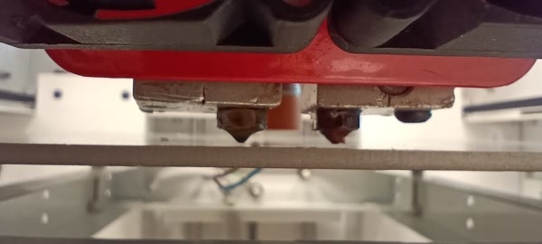
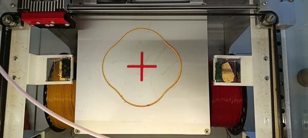
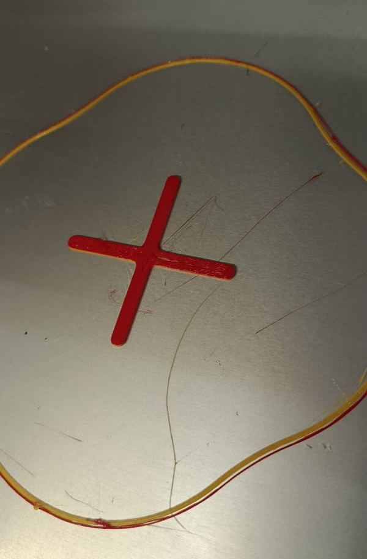
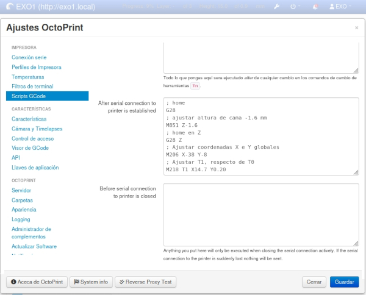

# Calibración Inicial y de  Mantenimiento

## Test movimientos

Antes de intentar una impresión es recomendable probar un par de comandos desde el `terminal` en la Web UI

```http
http://exo1.local
```

```gcode
G28 ; Home
```

```gcode
G28 X Y ; Home en X e Y (Esquina delantera izquierda)
```

```gcode
G28 Z ; Home en Z
```

```gcode
G1 X50 Y50 F3000 ; ir a (X=50, Y=50)
```

```gcode
G1 X110 Y110 F1000 ; ir a (X=110, Y=110) (centro de la cama)
```

```gcode
M122 ; estado de motores y sensores
```

```gcode
M106 P0 S150 ; Encender fan 1 a 150 de 255
```

```gcode
M106 P1 S255 ; Fan 2 solo es ON/OFF (0 a 254 -> OFF, 255 -> ON)
```

## Offsets

Los parámetros de la impresora, las medidas relevantes, como por ejemplo dimensiones de impresión, recorrido de los ejes, distancia entre extrusores, etc, se detallan en la instalación de `Marlin` en el Arduino. esta información se pude obtener como se muestra en [DatosImpresora](DatosImpresora.md) ejecutando en el terminal de la webUI el comando:

```gcode
M503
```

De la salida, nos interesan los parámetros `M206`, `M218` y `M851`

```diff
Recv: echo:  G21    ; Units in mm
Recv: 
Recv: echo:Filament settings: Disabled
Recv: echo:  M200 D1.75
Recv: echo:  M200 T1 D1.75
Recv: echo:  M200 D0
Recv: echo:Steps per unit:
Recv: echo:  M92 X80.00 Y80.00 Z400.00 E100.00
Recv: echo:Maximum feedrates (units/s):
Recv: echo:  M203 X300.00 Y300.00 Z5.00 E25.00
Recv: echo:Maximum Acceleration (units/s2):
Recv: echo:  M201 X3000 Y3000 Z100 E10000
Recv: echo:Acceleration (units/s2): P<print_accel> R<retract_accel> T<travel_accel>
Recv: echo:  M204 P3000.00 R3000.00 T3000.00
Recv: echo:Advanced: S<min_feedrate> T<min_travel_feedrate> B<min_segment_time_ms> X<max_xy_jerk> Z<max_z_jerk> E<max_e_jerk>
Recv: echo:  M205 S0.00 T0.00 B20000 X20.00 Y20.00 Z0.40 E5.00
Recv: echo:Home offset:
+Recv: echo:  M206 X0.00 Y0.00 Z0.00
Recv: echo:Hotend offsets:
+Recv: echo:  M218 T1 X14.50 Y-1.50
Recv: echo:Auto Bed Leveling:
Recv: echo:  M420 S0 Z0.00
Recv: echo:PID settings:
Recv: echo:  M301 P22.20 I1.08 D114.00
Recv: echo:Z-Probe Offset (mm):
+Recv: echo:  M851 Z0.00
Recv: ok
```

### Offset en Z

Desde la interfaz de `OctoDash` presionar la flecha hacia arriba


o en el terminal de la WebUI

```gcode
G1 Z0 ; Ir a Z=0
```

Este comando acerca la cama al extrusor, en este punto `Z0 = M851 Z0.00`, que es la medida que define el sensor de proximidad del eje Z, lo ideal una separación de apenas unas décimas, por ejemplo se puede usar una hoja de papel y debe pasar sin quedar frenada.

Si la cama queda muy alta o muy baja, primero se debe encontrar la diferencia adecuada, para eso desde el terminal en la WebUI, se puede modificar `M851` enviando:

```gcode
M851 Z-1 ; en donde un número negativo acerca la cama al extrusor y uno positivo la aleja
```

luego se debe hacer homing de nuevo

```gcode
G28 Z ; home en z
```

y comprobar si la distancia es la adecuada.

```gcode
G1 Z0 ; Ir al nuevo "0"
```

Probar distintos valores hasta que quede a la distancia adecuada, recordar que los valores no son acumulativos, asi que si "Z-1" queda lejos y queremos que quede 1mm más cerca, se debe enviar Z-2, ya que el 0 real lo sigue ordenando el sensor de la cama cada vez que se realiza el homing (`G28`).

En el caso de la EXO, el valor adecuado fue `-1.6`, entonces:

```gcode
M851 Z-1.6
```

Si se realiza nuevamente `M503`, se puede comprobar el cambio.

Este nuevo valor de `M851` solo permanecerá activo mientras esté encendida la impresora, ante un reinicio los valores volverán a los originales del Marlin. En condiciones normales solo bastaría guardar estos valores de manera persistente en la EEPROM del Arduino:

```gcode
M500 ; Actualizar EEPROM
```

Pero como se observa [DatosImpresora](DatosImpresora.md/#información-de-marlin), el Marlin instalado en el Arduino no admite modificaciones a la EEPROM, entonces, para no tener que re calibrar en cada inicio, se puede realizar el envío de los nuevos parámetros de manera automática en el arranque de la raspberry. Se incluye como scrip en OctoPrint, que se ejecuta cad vez que se logra conexión con el Arduino (Marlin).

* Preferencias
  * Scrips GCode
    * After serial connection to printer is established

y agregar

```gcode
; home
G28
; ajustar altura de cama -1.6 mm
M851 Z-1.6
; home en Z
G28 Z
```

### Nivelar la Cama

Desde la interfaz de `OctoDash` presionar la flecha hacia arriba


El extrusor debe quedar muy cerca de la cama



>[!Note]  
>Si la distancia es demasiado grande, o queda tocando primero Ajustar el [Offset en Z](#offset-en-z)

Luego en el área de control


Desplazarse a una esquina, y verificar con una hoja de papel si hay suficiente espacio entre el extrusor y la cama, con el tornillo de ajuste subir la cama hasta que el papel quede atrapado, luego liberar suavemente hasta que se pueda retirar el papel.

Repetir este paso en las 4 esquinas, luego desde el acceso rápido volver a realizar home `G28` y llevar la cama a Z=0 `G1 Z0`, verificar que la separación sea correcta, sino ajustar nuevamente el [Offset en Z](#offset-en-z)

## Offset en X e Y y distancia entre extrusores

Para verificar la alineación en coordenadas y el posicionamiento de los extrusores se imprime el archivo de prueba [X.gcode](G-Codes).


Se descubre que los ejes se encuentran corridos y además, aunque en el `Marlin` del Arduino, en la línea `M218 T1 X14.50 Y-1.50` se indica un offset entre los extrusores 1 y 2 en X de 14.5 y en Y de 1.5 mm, la impresión a dos colores indica que ese corrimiento es incorrecto.

Por medio de mediciones se determinó  que se deben efectuar correcciones en la posición de los extrusores:

* Extrusor 0
  * Corrimiento en X de 38mm a la derecha (negativo)
  * Corrimiento en Y de 8 mm hacia atrás (negativo)
* Extrusor 1
  * Corrimiento en X de 0.2 mm a la izquierda (positivo)
  * Corrimiento en Y de 1.7 mm hacia adelante (positivo)

Estos valores se corrigen con los comandos `M206`y `M218`

```gcode
M206 X-38 Y-8
```

```gcode
M218 T1 X14.7 Y0.20
```

Antes de imprimir se pueden hacer comprobaciones con los extrusores:

```gcode
;ir al centro en X e Y
G1 X110 Y110 F300
;Verificar que el extrusor 0 este en el centro de la cama
;Seleccionar Segundo Extrusor (T0 es el primero)
T1
;Verificar que el extrusor 1 este en el centro de la cama
```

Como comprobación final se vuelve a imprimir [X.gcode](G-Codes),  y se verifica que haya salido en el centro de la cama y que ambos colores estén alineados.





Como ya se estableció, al no poder actualizar la EEPROM, se agrega al script de arranque una  nueva línea:

* Preferencias
  * Scrips GCode
    * After serial connection to printer is established

y agregar:

```gcode
; home
G28
; ajustar altura de cama -1.6 mm
M851 Z-1.6
; home en Z
G28 Z
; Ajustar coordenadas X e Y globales
M206 X-38 Y-8
; Ajustar T1, respecto de T0
M218 T1 X14.7 Y0.20
```



Finalizados estos pasos la impresora está lista para imprimir.

> [!IMPORTANT]  
> Es posible que sea necesario re calibrar cada cierto tiempo de uso, en especial si se realizó un ajuste o limpieza de los extrusores.

## Licencia

Este proyecto está licenciado bajo la Licencia MIT.
Está permitido el uso, copia, modificaciones y distribución del software libremente, siempre que se incluya el aviso de derechos de autor original.  

Para más información, consultar el archivo [LICENSE](LICENSE)

## Contacto

Ante cualquier consulta o para informar un error contactase a [ec4lab@gmail.com](ec4lab#gmail.com)
