# Procedimiento para instalar Octoprint

## Obtener información del sistema actual

Antes de reinstalar es necesario respaldar toda la información posible del sistema y controladores.

Además del [manual del usuario](EXO3DFAB_Manual.pdf), existen maneras de obtener información adicional de la impresora y su configuración:

* Desde la interfaz web
* Plugins Instalados
* A través de comandos en el terminal (Octoprint)
* Desde la APIKEY

Para dar un mejor orden se guardó la info en [DatosImpresora](DatosImpresora.md)

## Instalar Octoprint

### Grabar la imagen de disco en la SD

Para instalar el S.O. se debe `flashear`una SD, que luego se coloca en raspberry Pi, para esto se ha utilizando [Pi Imager](https://www.raspberrypi.com/software/).

>![Note]  
>Existen otras formas de flashear una SD como Rufus, BalenaEtcher, etc. Pero en este caso se prefirió PiImager ya que permite un setup previo en donde se establecen algunos parámetros del S.O.

* Seleccionar dispositivo -> Raspberry 3 B+
* Seleccionar sistema operativo -> OCTOPI (STABLE)  
  * Other specific-purpose OS
    * 3D printing
      * OctoPi
        * OctoPi  (Stable)

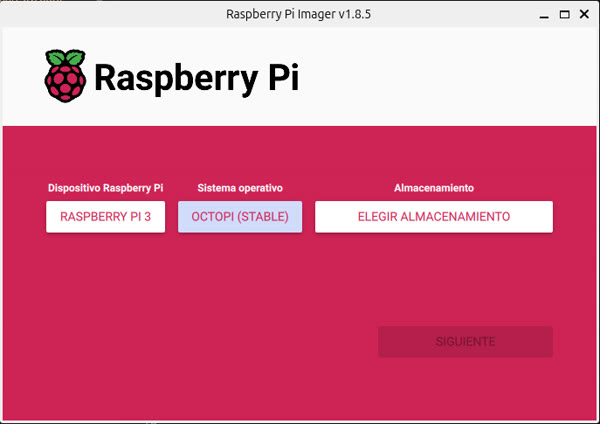

Al dar siguiente se consulta por la personalización del S.O., elegir si y a continuación se configura:

* Opciones del S.O.  
  * Nombre del anfitrión y pass  
  * Nombre de usuario y pass  
  * Configurar WiFi (Opcional)  
  * Ajustes Regionales  
  * Habilitar Acceso SSH  

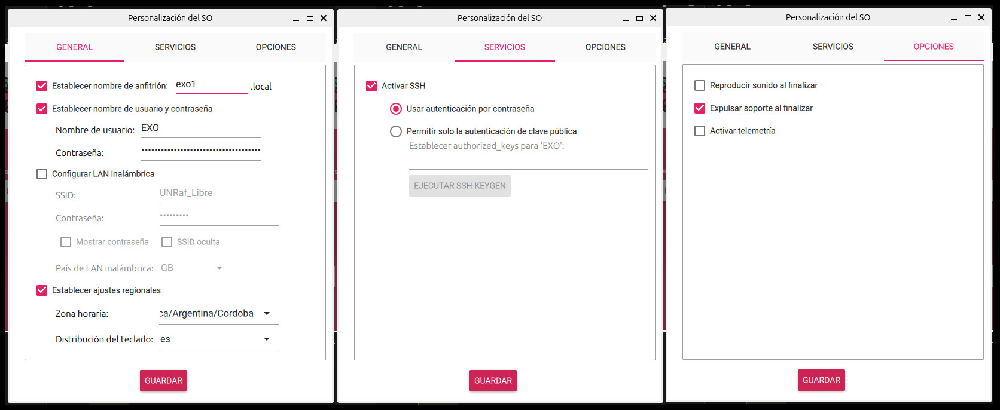

Una vez finalizada la grabación de la imagen. Se  instala la SD en la RaspberryPi y se inicia el sistema.

### Pantalla Rotada

Si al iniciar el S.O. el texto aparece invertido es posible rotar la pantalla, para eso hay que editar el `cmdline.txt`

Desde un terminal (Linux), o consola PowerShell (Windows), ingresar por ssh a la raspberry:

>![Note]  
>Tanto la impresora como la PC deben estar conectadas por cable a la misma red

```bash
shh  EXO@exo1.local
```

`Credenciales`: Nombre de usuario y pass, utilizados para crear la SD.

```bash
sudo nano /boot/firmware/cmdline.txt
```

>[!WARNING]  
>Tener en cuenta que todas las opciones están en una misma línea, **NO** se debe crear una nueva línea, sino al final.

dejar un espacio y agregar:

```text
fbcon=rotate:2
```

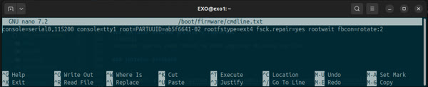

Reiniciar el S.O.

```bash
sudo reboot
```

## Primer ingreso a OctoPrint

En este punto, aunque en la pantalla de la impresora solo se vea la CLI, desde la interfaz web ya es posible acceder a OctoPrint.

>![Note]  
>Tanto la impresora como la PC deben estar conectadas por cable a la misma red

En el explorador ingresar a:

```http
http://exo1.local
```

Si no se identifica el hostname:

```http
http://IP_DE_LA_IMPRESORA
```

`Credenciales`: Nombre del anfitrión y pass, utilizados para crear la SD.

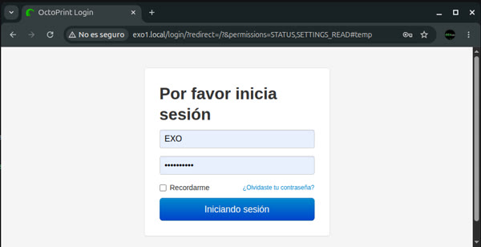

### Cambiar Idioma al Español

Descargar paquete .zip de <https://community.octoprint.org/t/translating-octoprint/21144>

Luego en la interfaz web

* Settings
  * Appeareance
    * Language packs
      * Manage

Subir el zip descargado y agregar.

Reiniciar el sistema

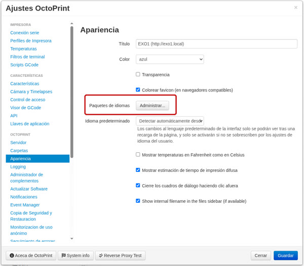

### Otros ajustes

#### Conexión

**Puerto serie:** /dev/ttyUSBo  
**Velocidad de conexión:** 115200  
**Perfil de la impresora:** EXO1

* [x] Guardar configuraciones de conexión  
* [x] Conexión automática al arrancar el servidor

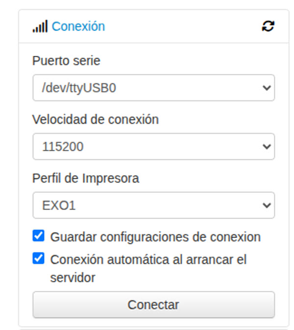

#### Perfil de la impresora

* Preferencias
  * Perfiles de Impresora
    * Agregar perfil

Y completar los datos:

|Campo|Valor|
|---|---|
|Nombre|EXO1|
|identificación|_default|
|Modelo|3DFab_X2|
|Ancho (X)|220  mm|
|Profundidad (Y)|220 mm|
|Altura (Z)|205 mm|
|Diámetro de Boquilla|0,4 mm|
|Número de extrusores|2|

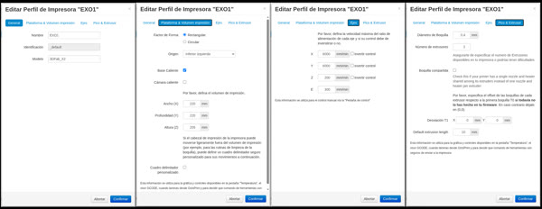

#### Activar CORS

Previo a la instalación de la interfaz touch, es necesario activar la opción Cross Origin Resource Sharing, en:

* Settings
  * API

* [x] Permitir Cross Origin Resource Sharing (CORS)  

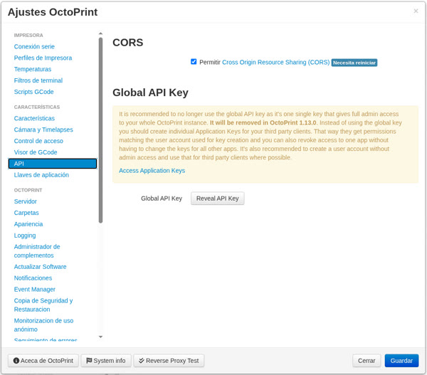

Reiniciar el sistema

## Instalar Interfaz OctoDash

Como se mencionó antes, TOUCHUI fue abandonado, como alternativa se instala la interfaz [OctoDash](ttps://unchartedbull-github-io.translate.goog/OctoDash/index.html?_x_tr_sl=en&_x_tr_tl=es&_x_tr_hl=es&_x_tr_pto=tc)

### Entrar vía ssh a la raspberry

```bash
shh  EXO@exo1.local
```

### Actualizar el sistema (puede demorar varios minutos)

```bash
sudo apt update
```

```bash
sudo apt upgrade
```

Cuando pregunte:

```bash
*** initramfs.conf (Y/I/N/O/D/Z) [default=N] ? # Elegir “Y”
```

Reparar dependencias

```bash
sudo apt install -f
```

### Instalar entorno gráfico y librerías

```bash
sudo apt-get install libgtk-3-0 xserver-xorg xinit x11-xserver-utils ratpoison
```

```bash
sudo reboot
```

```bash
sudo apt-get install git build-essential xorg-dev xutils-dev x11proto-dri2-dev
```

```bash
sudo reboot
```

```bash
sudo apt-get install libltdl-dev libtool automake libdrm-dev
```

```bash
sudo reboot
```

>![Note]  
>Recordar que en cada reboot se debe ingresar de nuevo por ssh

### instalar OctoDash

```bash
bash <(wget -qO- https://github.com/UnchartedBull/OctoDash/raw/main/scripts/install.sh)
```

Durante el proceso de instalación consulta si se desea instalar plugins, en este caso se elige  `si` solo al primero, el resto se puede instalar desde la interfaz.

Luego aparecen opciones:

* Arranque automático: `Sí`
* Actualizar automáticamente: `Sí`
* Reiniciar: `Sí`

Cuando inicie OctoDash, la primera vez arranca el wizard de configuración, seguir los pasos en pantalla.

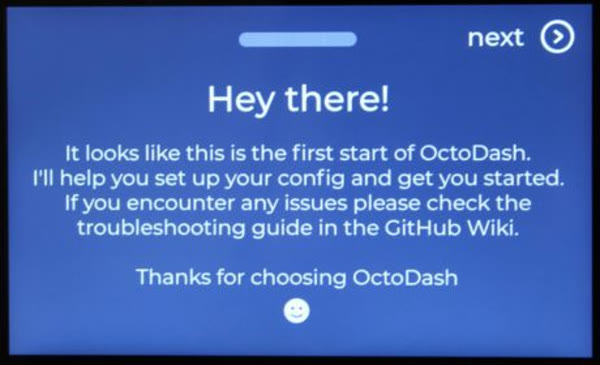

### Rotar la pantalla de OctoDash

Si al arrancar la interfaz está al revés, se puede corregir, primero por línea de comandos y luego se agrega al arranque para que lo realize de manera automática.

Se debe tener en cuenta que la interfaz y el sensor táctil son dos cosas separadas y se debe revisar si se tienen que invertir ambas o solo una.

Entrar vía ssh a la raspberry

```bash
shh  EXO@exo1.local
```

instalar x input

```bash
sudo apt install xinput
```

Ver como se llama el touch

```bash
DISPLAY=:0 xinput list
```

La salida va a ser similar a:

```text
⎡ Virtual core pointer                    id=2 [master pointer  (3)]
⎜   ↳ Virtual core XTEST pointer              id=4 [slave  pointer  (2)]
⎜   ↳ 深圳市全动电子技术有限公司 ByQDtech 触控USB鼠标 id=7 [slave  pointer  (2)]
⎜   ↳ HID 04f3:0103 Consumer Control          id=9 [slave  pointer  (2)]
⎣ Virtual core keyboard                   id=3 [master keyboard (2)]
    ↳ Virtual core XTEST keyboard             id=5 [slave  keyboard (3)]
    ↳ vc4-hdmi                                id=6 [slave  keyboard (3)]
    ↳ HID 04f3:0103                           id=8 [slave  keyboard (3)]
    ↳ HID 04f3:0103 System Control            id=10 [slave  keyboard (3)]
```

En este caso: `深圳市全动电子技术有限公司 ByQDtech 触控USB鼠标` es el display

Probar invertir la gráfica

```bash
xrandr --output HDMI-1 --rotate inverted
```

Probar invertir el táctil

```bash
xinput map-to-output "深圳市全动电子技术有限公司 ByQDtech 触控USB鼠标" HDMI-1
```

Si con esto se obtiene la imagen y el sensor touch en la posición correcta, podemos agregar las instrucciones al `xinitrc`, para que el S.O lo ejecute en cada arranque

```bash
sudo nano /home/EXO/.xinitrc
```

y agregar antes de `ratpoison&`

```text
# Si falla aumentar
sleep 2
# Rotar la interfaz
xrandr --output HDMI-1 --rotate inverted
# Rotar el Touch
xinput map-to-output "深圳市全动电子技术有限公司 ByQDtech 触控USB鼠标" HDMI-1
# Si falla descomentar
# sleep 2
```

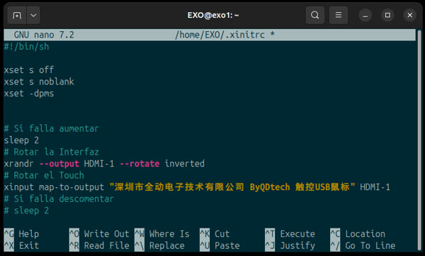

Guardar, salir y reiniciar

Cuando inicie OctoDash, la primera vez arranca el wizard de configuración, seguir los pasos en pantalla

### Editar Json lo iconos accesos rápidos


Se realizó una edición de los accesos rápidos, para adaptarlos a el uso que se le dará en el laboratorio.

```Bash
sudo nano ~/.config/octodash/config.json
```

>[!Note]  
>El `json` a continuación incluye comentarios, se deben eliminar en el archivo original o dará error al iniciar

```json
"octodash": {
        "customActions": [
                {       # Icono de casa, hace Home en X, Y y Z
                        "icon": "house-chimney", 
                        "command": "G28",
                        "color": "#dcdde1",
                        "confirm": false,
                        "exit": true
                },
                {       # Icono de una flecha hacia arriba, Lleva la cama a Z=0
                        "icon": "arrow-up",
                        "command": "G1 Z0",
                        "color": "#4bae50",
                        "confirm": false,
                        "exit": true
                },
                {       # Icono de llama, precalienta la cama a 50 y el extrusor 1 a 185
                        "icon": "fire-flame-curved",
                        "command": "M140 S50; M104 S185",
                        "color": "#e1b12c",
                        "confirm": false,
                        "exit": true
                },
                {       #Icono de nieve, apaga cama y extrusores
                        "icon": "snowflake",
                        "command": "M140 S0; M104 S0; M104 T1 S0",
                        "color": "#0097e6",
                        "confirm": false,
                },
                {       # icono flecha rotando, reinicia octoprint (no S.O.)
                        "icon": "rotate-right",
                        "command": "[!RELOAD]",
                        "color": "#7f8fa6",
                        "confirm": true,
                        "exit": false
                },
                {       # Icono power - Apaga el sistema
                        "icon": "power-off",
                        "command": "[!SHUTDOWN]",
                        "color": "#e84118",
                        "confirm": true,
                        "exit": false
                }
        ],
```

>[!TIP]  
>Más iconos en <https://fontawesome.com/>

## Invertir los controles en la interfaz

En las opciones de control, puede suceder que los controles de subir, bajar, adelante y atrás, estén invertidos, entonces se puede habilitar la inversión en la configuración

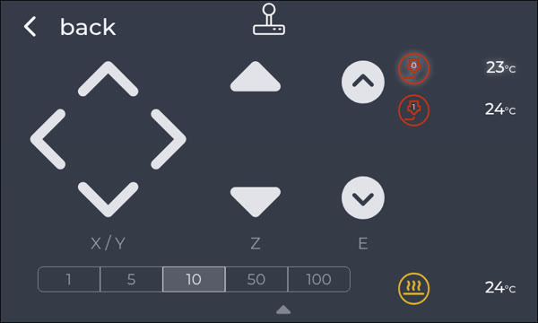

```Bash
sudo nano ~/.config/octodash/config.json
```

```json
"invertAxisControl": {
        "x": false,
        "y": true,
        "z": true
},
```

## Plugin PenDrive OctoDash

La impresora EXO tiene un puerto USB al exterior donde se puede conectar un pendrive y de esta manera imprimir directamente en la impresora sin necesidad de conectarse a través de la interfaz web, pero desafortunadamente OctoDash no contiene un plugin para esta situación, entonces, utilizando servicios en combinación con un script se creó una automatización que:

* Detecta si se conecta un pendrive al puerto de la raspberry
* Monta el USB  
* Se activa un servicio que localiza los .gcode dentro del pendrive  
* Copia todos los archivos a una carpeta "PenDrive"  
* Permite el acceso a los archivos desde la interfaz gráfica  

### Crear del Scrip

* Monta el USB temporalmente  
* Busca recursivamente `.gcode`  
* Los sube vía `API` a OctoPrint  
* Se indexan automáticamente  
* Aparecen en OctoDash  
* Desmonta el USB

Crear el archivo `mount_usb_octoprint.sh`

```bash
sudo nano /usr/local/bin/mount_usb_octoprint.sh
```

y dentro pegar:

```text
#!/bin/bash

# =========================
# CONFIGURACIÓN
# =========================
API_KEY="XxxxXXXxx-XXxxx" #Buscarla en Configuración/API/Octodash
DEST_FOLDER="PenDrive" #Se puede colocar cualquier nombre
MOUNT_POINT="/mnt/usb_temp"
DEVICE=$1
LOG="/tmp/usb_debug.log" # Para control y/o debug

# =========================
# INICIO
# =========================
echo "==== $(date) ====" >> $LOG
echo "Device: $DEVICE" >> $LOG

mkdir -p "$MOUNT_POINT"

# Esperar a que el USB esté listo
sleep 2

# Montar
mount "$DEVICE" "$MOUNT_POINT" 2>> $LOG

if mountpoint -q "$MOUNT_POINT"; then
    echo "Mount OK" >> $LOG

    # Subir archivos a OctoPrint vía API
    find "$MOUNT_POINT" -type f \( -iname "*.gcode" -o -iname "*.gco" \) | while read file; do

        echo "Uploading: $file" >> $LOG

        curl -s -X POST http://localhost/api/files/local \
            -H "X-Api-Key: $API_KEY" \
            -F "file=@\"$file\"" \
            -F "path=$DEST_FOLDER" \
            -F "select=false" \
            -F "print=false" >> $LOG

    done

    echo "Upload done" >> $LOG

    # Desmontar
    umount "$MOUNT_POINT"
    echo "Umount OK" >> $LOG

else
    echo "Mount FAILED" >> $LOG
fi
```

Guardar, cerrar y luego hacer ejecutable le script.

```bash
sudo chmod +x /usr/local/bin/mount_usb_octoprint.sh
```

### Crear el servicio

* Lanza el scrip cada vez que se conecta un pendrive al USB

Crear el archivo `octoprint-usb-mount@.service`

```bash
sudo nano /etc/systemd/system/octoprint-usb-mount@.service
```

y dentro pegar:

```text
[Unit]
Description=Mount USB for OctoPrint (%i)

[Service]
Type=oneshot
ExecStart=/bin/bash /usr/local/bin/mount_usb_octoprint.sh /dev/%i
```

Guardar y cerrar.

### Crear Regla udev

* udev detecta el dispositivo USB con filesystem  
* systemd ejecuta:  
  * <octoprint-usb-mount@sda1.service>
* Se ejecuta el script

Crear el archivo `99-octoprint-usb.rules

```bash
/etc/udev/rules.d/99-octoprint-usb.rules
```

y dentro pegar:

```text
ACTION=="add", ENV{ID_BUS}=="usb", ENV{ID_FS_USAGE}=="filesystem", TAG+="systemd", ENV{SYSTEMD_WANTS}="octoprint-usb-mount@%k.service"
```

Guardar y cerrar.

### Borrado de la carpeta `PenDrive` en el arranque (Opcional)

Según el flujo de trabajo del scrip, los archivos del pendrive se copian a la memoria USB, y luego desde allí se pueden imprimir, es decir, no se lee el archivo desde el pendrive para imprimir, eso se hace para mayor estabilidad del archivo al imprimir, y para poder retirar el pendrive sin afectar al sistema.

Para evitar acumulación de archivos dentro de la SD, cada vez que se reinicia el sistema la carpeta será borrada ejecutando un comando al inicio, editando nuevamente `xinitrc`

Editar el archivo `xinitrc`

```bash
sudo nano /home/EXO/.xinitrc
```

Agregar ates de lanzarOctoDash:

```text
...
# Eliminar Carpeta Pendrive y su contenido
rm -R /home/EXO/.octoprint/uploads/PenDrive

# Lanzar Octodash
...
```

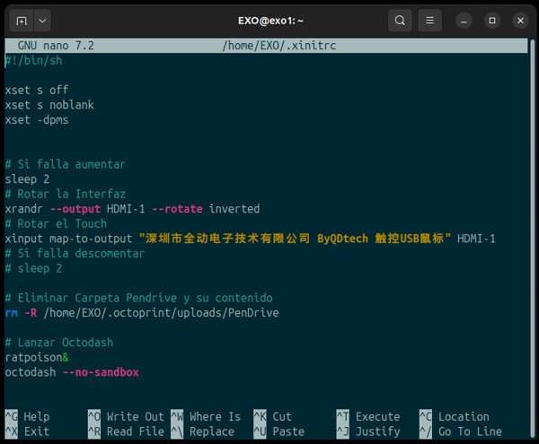

### Recargar Configuración

Una vez finalizado recargar la configuración (O reiniciar el sistema)

```bash
sudo systemctl daemon-reload
sudo udevadm control --reload
```

Ahora, el servicio se activará cada vez que se conecte un pendrive al USB

>[!NOTE]  
>Si el archivo es muy grande o son muchos archivos, es posible que exista una demora en crear la carpeta, esperar unos segundos, volver a la pantalla principal y volver a ingresar a la carpeta para refrescar.

## Vista previa de los archivos a imprimir

Es posible previsualizar una imagen (render), de la pieza que se está por imprimir, para esto se debe instalar un plugin en Octoprint llamado `Slicer Thumbnails`

* Preferencias
  * Administrador de complementos
    * Get More
      * Buscar: "Slicer Thumbnails" e instalar

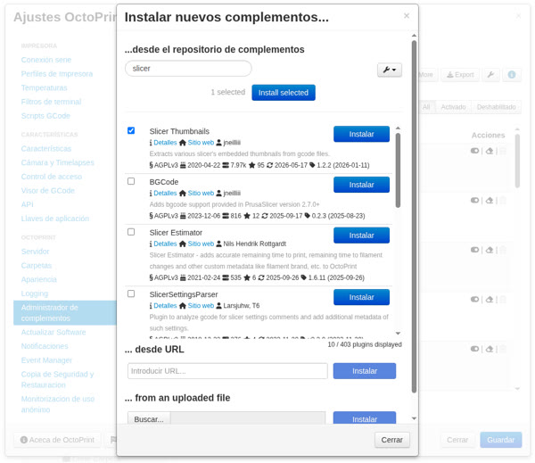

Este plugin detecta si los G-Codes contienen una imagen para la previsualización, es importante configurar los slicers para que las generen. ver [Imprmir](imprimir.md)

## Imagen de timelapse invertida

Si la imagen del interior de la cámara de impresión aparece invertida se puede rotar desde las `settings`de OctoPrint en la WebUI:

* Preferencias
  * Classic Webcam

* [x] Voltear la cámara web horizontalmente
* [x] Voltear la cámara web verticalmente

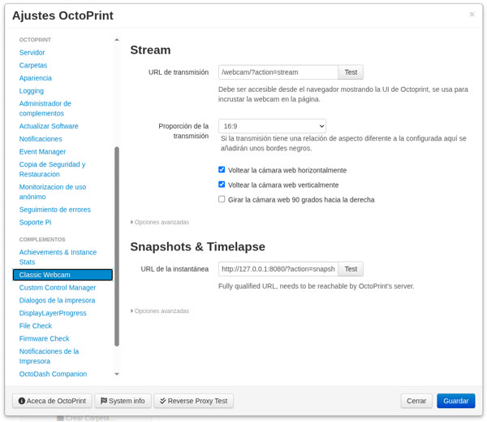

## Pantalla Personalizada en el inicio (Ocultar Texto)

En el arranque del S.O., en lugar de texto, mostrar un logo personalizado en la pantalla.

***MUY PRONTO...***

## Licencia

Este proyecto está licenciado bajo la Licencia MIT.
Está permitido el uso, copia, modificaciones y distribución del software libremente, siempre que se incluya el aviso de derechos de autor original.  

Para más información, consultar el archivo [LICENSE](LICENSE)

## Contacto

Ante cualquier consulta o para informar un error contactase a [ec4lab@gmail.com](ec4lab#gmail.com)