# EXO_Smart3DFabX2

El propósito de este repositorio es documentar el proceso de actualización de software y hardware de una impresora 3d Marca EXO, modelo 3D Fab X2.
Estos son los trabajos realizados

## Back Up de Seguridad

La información general de la impresora se encuentra en el  [manual](EXO3DFAB_Manual.pdf), además se realizó un backup completo de la configuración del Octoprint Original vía API y se extrajeron los datos de Marlin desde el Arduino a través de comandos en el terminal, en el archivo [DatosImpresora.md](DatosImpresora.md) se detalla la información obtenida.

También se hizo un backup de la imagen original, manteniendo la posibilidad de restaurar el S.O. original en caso de ser necesario.

## Sistema Operativo

El sistema operativo era `OctoPrint 1.3.4` el cual contaba con `Python 2.7`, lo que producía errores de actualización y deprecación de plugins.

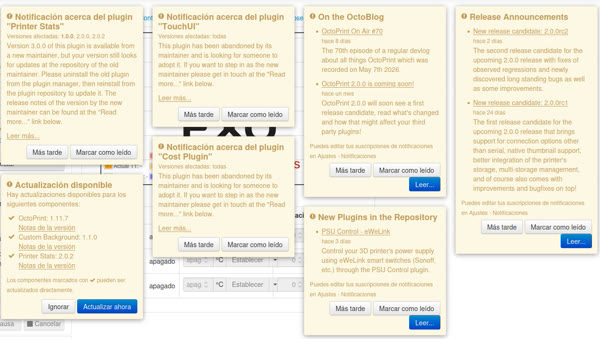

Pero actualizar via WebUI no era posible

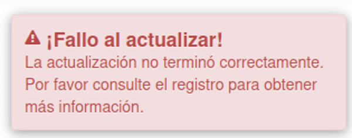

Se realizó una re instalación limpia del sistema operativo OctoPrint V=1.11.7, se establecieron credenciales para acceso por ssh y se estableció un nombre de host `exo1.local` para poder utilizar la interfaz web sin necesidad de identificar la IP.

```web
http://exo1.local/api/version?apikey=COLOCAR_ACA_EL_APIKEY
```

{  
api "0.1"  
server "1.11.7"  
text "OctoPrint 1.11.7"  
}

El procedimiento se documentó paso a paso [aquí](Procedimiento.md)

## Nuevo Plugin de pantalla

El plugin `TouchUI`, que utilizaba la pantalla ha sido abandonado y ya no recibe actualizaciones.

  

Interfaz antigua `TouchUI`

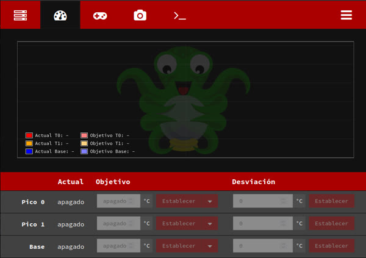

Se eligió una nueva interfaz de código abierto: "OctoDash"
Que es una interfaz moderna, intuitiva y totalmente configurable.

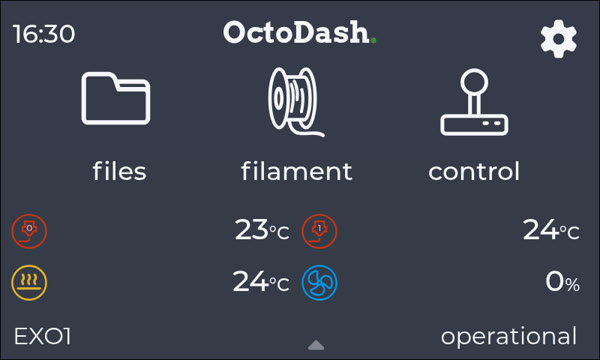

Además, admite vista previa de los archivos antes de imprimir:

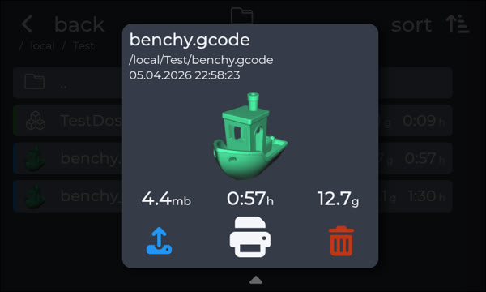

>[!NOTE]  
>La interfaz de OctoDash se encuentra en inglés, pero los desarrolladores indican que en la próxima actualización será posible cambiar el idioma

Mas información sobre la interfaz en las [instrucciones de uso](#instrucciones-de-uso) y en [Procedimiento.md](Procedimiento.md#instalar-interfaz-octodash)

## Advertencia de bajo voltaje

Durante el uso solían aparecer mensajes de error de bajo voltaje

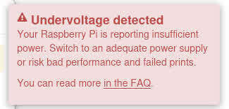

La arquitectura actual de la EXO utiliza una fuente de poder de 12V de 30A, ubicada en la parte posterior, esta fuente alimenta, por un lado el Arduino y la Ramps y por otro a una fuente step down ubicada en el frente de la impresora, esta fuente es de 5v y alimenta la raspberry y esta a su vez mediante uno de los puertos USB alimenta a la pantalla.

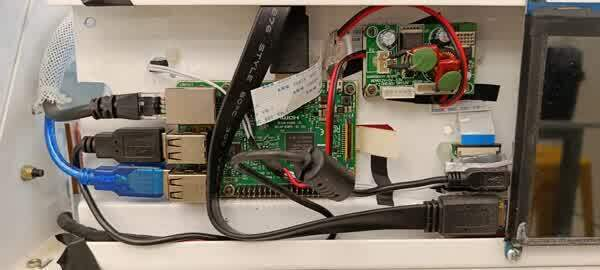

La fuente original tenía una corriente de salida muy justa, por eso se reemplazó por un nuevo módulo: XL4016 de 10A.

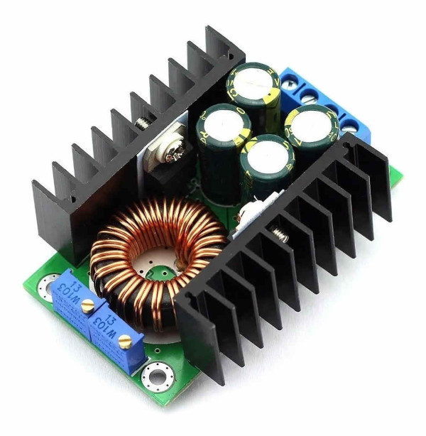

## Alimentadores de Filamento

Se reemplazaron los soportes originales que tenían mucho rozamiento, ocasionando que el alimentador del extrusor patinara, generando impresiones de mala calidad o incluso interrupciones, además no era compatible con carreteles más anchos

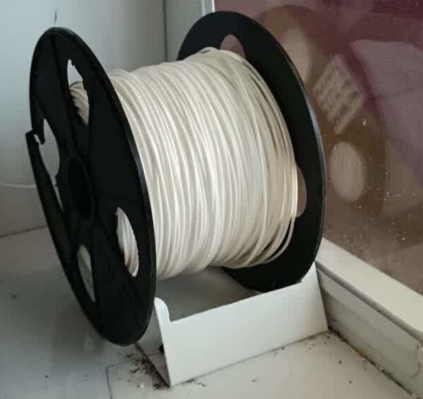

Se diseñaron nuevos soportes con rodamientos, y que se adapten a diferentes anchos de carrete.

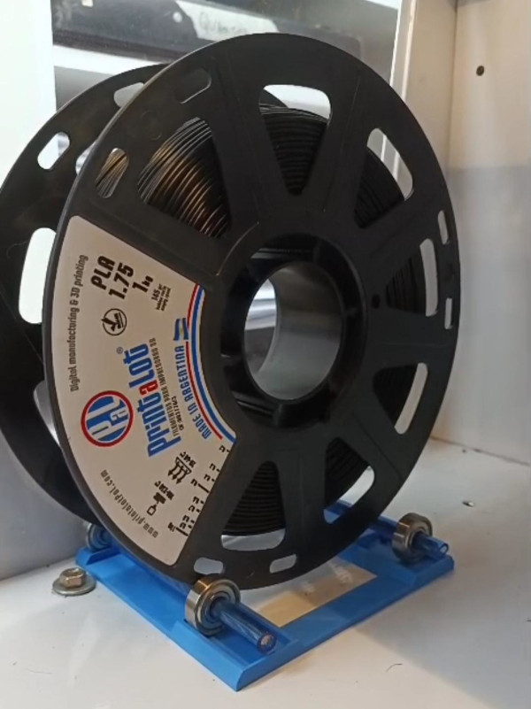

## Problemas de sobrecalentamiento

La ramps se calienta demasiado debido a una deficiente refrigeración, en ocasiones esto genera una pérdida de comunicación entre la raspberry y el Arduino, provocando errores de impresión e incluso la parada total y pérdida del trabajo.

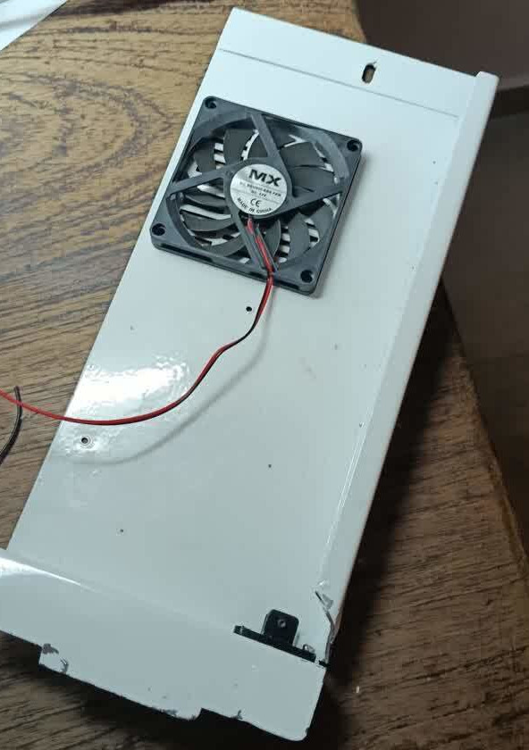

Se adaptó un cooler adicional para incrementar el caudal de aire circulante, ahora es posible utilizar ambos extrusores y la cama calefaccionada en simultáneo sin riesgo de interrupciones por calentamiento excesivo.

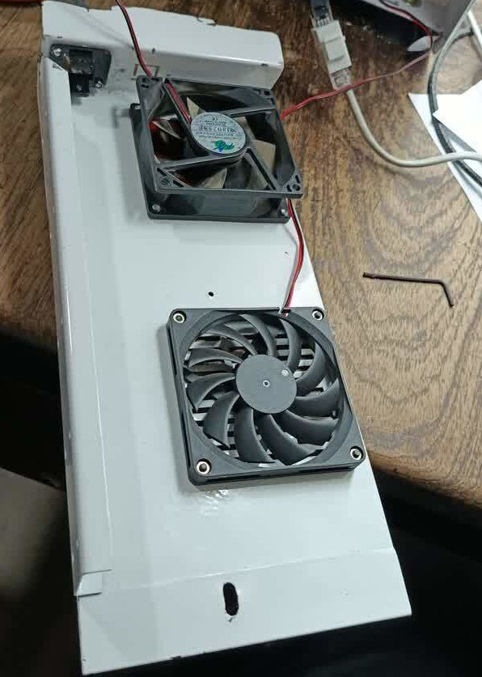

## Cambio de resortes de la mesa

La mesa original tenía unos resortes muy débiles, provocando vibraciones de la cama al imprimir, lo que se traducía en impresiones de mala calidad, se reemplazaron los resortes por unos de iguales dimensiones pero alambre más grueso para una mayor rigidez

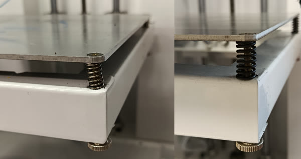

## Calibración

Se efectuó una serie de pasos para calibrar altura de mesa y desplazamientos en X e Y, y se creó un [documento](Calibración.md) con el procedimiento adecuado para un correcto uso.

## Instrucciones de uso

En este [procedimiento](Imprimir.md), se detallan los pasos a seguir para el uso seguro de la impresora, ya sea desde la interfaz web o directamente sobre la pantalla de la impresora. El documento también incluye parámetros básicos de impresión para los softwares [UltimakerCura](https://ultimaker.com/es/software/ultimaker-cura/) y [OrcaSlicer](https://orcaslicer.org/es/)

## Propuesta de mejoras futuras

Se mejoró mucho la calidad de las impresiones y la confiabilidad de la herramienta, aunque aún quedan mejoras por realizar, esta es una lista tentativa de posibles trabajos futuros sobre la EXO:

* Actualizar el firmware `Marlin` del Arduino
  * Explorar la conveniencia o no de permitir la escritura de la EEPROM
* El Cooler del extrusor 2 solo funciona on/off, ver la posibilidad de regular como el cooler del extrusor 1
* Encendido de los coolers de la ramps y fuente por software (apagar durante stand by) para disminuir ruido.
* Reforzar la estructura de la cama, aún no tiene la rigidez apropiada.

## Licencia

Este proyecto está licenciado bajo la Licencia MIT.
Está permitido el uso, copia, modificaciones y distribución del software libremente, siempre que se incluya el aviso de derechos de autor original.  

Para más información, consultar el archivo [LICENSE](LICENSE)

## Contacto

Ante cualquier consulta o para informar un error contactase a [ec4lab@gmail.com](ec4lab#gmail.com)
